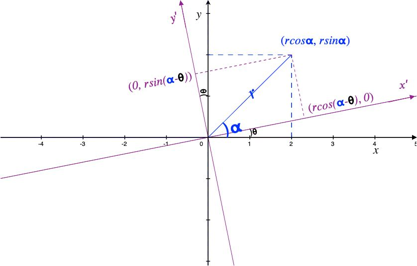

## 正交矩阵
$n \times n$级**实**矩阵$A$，如果满足下列关系，则称其为**正交矩阵**
$$
A'A=E=AA', \quad A^{-1}=A'
$$

如果把$A$的每一行看作一个基，也就是任意不同的两行之间内积为零，而其自身的$2$范式模长为$1$,对应到坐标系就是直角坐标系的$n$维扩展。

标准的$E$是正交矩阵，非标准的正交矩阵可以理解为$E$的旋转或各轴的取反，例如
$$
\left [ \begin{array}{c} \cos\theta &\sin\theta \\
-\sin\theta &\cos\theta \end{array} \right ]
$$
可以理解为标准二维直角坐标系逆时针旋转了$\theta$角形成的新坐标系(如图，紫色$ox'y'$)。

在标准坐标下系的任一向量都可表示成$（r\cos\alpha,r\sin\alpha）$的坐标形式, 现在保持向量不动，把坐标系逆时针旋转$\theta$角，则它在新坐标系中的坐标会发生相应的变化，如何变化？

就是左乘一个正交矩阵：
$$
\left [ \begin{array}{c} \cos\theta &\sin\theta \\
-\sin\theta &\cos\theta \end{array} \right ]\left [ \begin{array}{c} r\cos\alpha \\ r\sin\alpha \end{array} \right ]=\left [ \begin{array}{c} r\cos(\alpha-\theta) \\ r\sin(\alpha-\theta) \end{array} \right ]
$$
结果与几何作图吻合， 由此可见，这种正交矩阵左乘作用效果相当于旋转了一个角度。

## 镜面反射

然而，如下
$$
\left [ \begin{array}{c} \cos\theta &\sin\theta \\
\sin\theta & -\cos\theta \end{array} \right ]
$$ 
也是一正交矩阵，它相当于逆时针旋转后再把$y$轴对折，物理上若不对折是无论如何也达不到运算所得结果的，显然这类正交矩阵既包括旋转还包括镜面反射。

### 总结
$$AA'=E, \quad |A|^2=1,\quad |A|=±1$$
- $|A|=1$， 时正交矩阵可以理解为坐标系的旋转（总是存在一个角度与之对应的)
- $|A|=-1$, 时，既有旋转也有境面反射，（可能不止一次轴反射）
